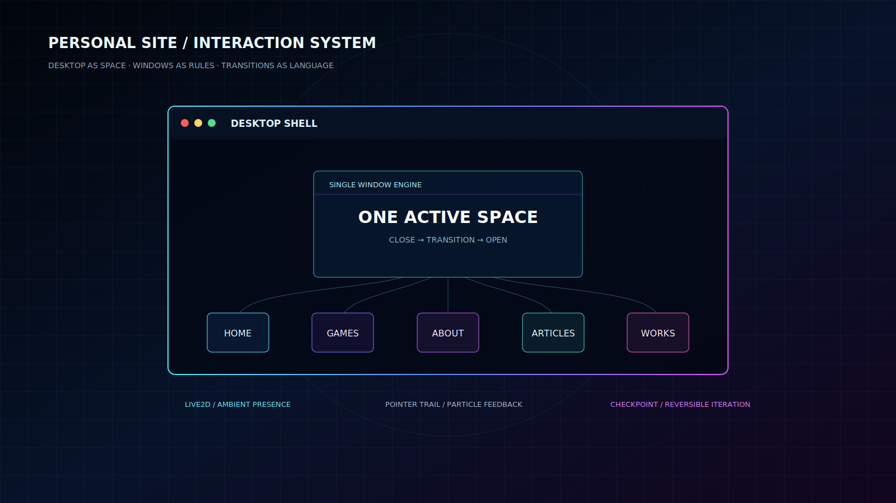
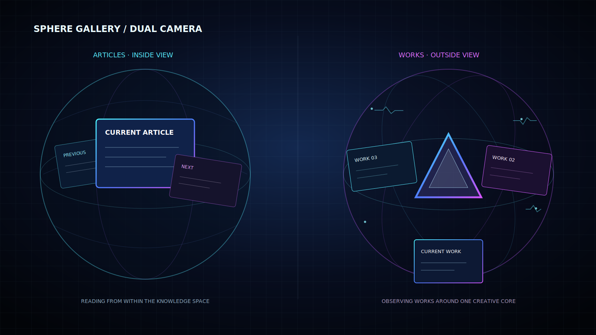
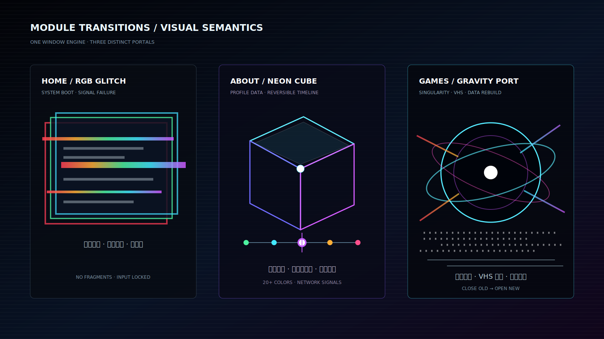

# 把个人网站做成一座可进入的数字空间

最初，我只是想做一个能放自我介绍、文章和作品的个人网站。但真正开始之后，我很快发现：如果它只是顶部导航、几张卡片和一条从上到下的长页面，它并不能代表我对数字产品的兴趣。

我希望访问者不是“浏览一份线上简历”，而是**进入一套属于我的数字空间**。于是，这个网站逐渐从普通博客变成了桌面系统，又从桌面系统长出了球形画廊、三维时间线、引力转场、VHS 噪点和游戏中心。

这篇文章记录的不是一个一次成型的方案，而是一连串设计判断：什么值得保留，什么虽然炫但会破坏体验，什么必须回退，以及怎样让不同特效最终成为同一套交互语言。

*图 1：网站不是一组孤立页面，而是一套由桌面、窗口引擎和五个内容模块组成的交互系统。*

## 一、先确定核心隐喻：这里是一张桌面，不是落地页

第一版页面仍然带着传统个人主页的影子：内容区像长页面一样纵向堆叠，用户一进入就看到所有信息。后来我把这个结构彻底换掉，让首屏只留下桌面氛围、桌面图标和底部 Dock。

这次改动确立了整个网站最重要的规则：

> 首屏负责建立空间，内容必须由用户主动打开。

首页、游戏、关于、文章和作品成为五个桌面入口。点击图标后，内容不再把页面向下撑长，而是以窗口形式出现。Live2D、鼠标拖影和点击粒子则留在桌面层，负责让这个空间保持“活着”的感觉。

这个桌面隐喻也改变了后续所有设计决策：关闭按钮必须明显，窗口需要有层级，用户要能从一个功能自然切换到另一个功能，任何弹窗都不能把背景滚动和其他区域的操作一起带走。

## 二、先把窗口系统做好，再给每个模块设计性格

早期窗口支持拖动、居中和关闭。没有拖动过的窗口默认居中；拖动过以后，本次页面会记住它的位置；刷新页面后，所有拖动痕迹清空。后来为了让操作更可预测，普通窗口再次打开时统一回到屏幕中心，而全屏沉浸式的“文章”和“作品”保持自己的空间逻辑。

窗口交互最终形成了几条基础约束：

1. 同一时间只展示一个主窗口。
2. 当前窗口仍在展示时，重复点击同一个入口无效。
3. 点击其他入口时，必须先完整执行当前窗口自己的关闭动画，再打开下一个窗口。
4. 动画期间锁定页面点击，避免两个转场叠在一起。
5. 弹窗内容独立滚动，不把滑动传递到桌面或其他窗口。
6. 关闭按钮始终位于最高交互层，并具有足够明显的视觉反馈。

页面整体缩放曾带来一个很隐蔽的问题：拖动代码拿到的是缩放后的屏幕坐标，却把它当成未缩放坐标写回窗口位置，导致鼠标刚按下，窗口就先跳走。修复坐标换算之后，拖动才真正变得稳定。这也提醒我，视觉缩放不能只看“变小了没有”，还必须检查交互坐标是否仍然属于同一个空间。

## 三、文章与作品：同一个球体，两种观看方式

“我的文章”和“我的作品”没有继续使用普通卡片列表，而是共同采用一套真正的 3D 球形内容系统。

- **文章是球内视角。** 用户像站在球体内部，当前文章占据视野中心，上一项和下一项只露出边缘，让内容像沿着弧形墙面流动。
- **作品是球外视角。** 用户从外部观察球体，作品卡围绕中央晶体旋转，更像一个可操作的数字展厅。

*图 2：文章强调“沉浸阅读”，作品强调“观察与选择”，两者共享球形运动规律，但镜头关系不同。*

为了让球形轮播真正可用，细节经历了很多轮调整：

- 第一项和最后一项都必须能到达，不能因为滚动边界被卡住。
- 切换完成后只展示某一篇文章或某一个作品，不停留在两个项目之间的模糊状态。
- 当前内容由小变大进入，离开的内容由大变小退出。
- 触控板双指上下滑动和鼠标滚轮都映射到横向球体转动，并且禁止意外触发页面上下滚动。
- 文案必须和当前卡片严格同步，不能出现“画面已经到第二项，标题仍然是第一项”的错位。
- 当前卡片居中，前后卡片只作为空间提示，不抢走注意力。

球体中央最终只保留一个半透明晶体，所有作品围绕它转动。晶体会在不少于二十种色彩之间缓慢变化，赤、橙、黄、绿、青、蓝、紫都能出现。球形连线上叠加大量短暂的网络电信号，寓意全球网络互联，但亮度和持续时间被压低，只作为背景信息，不盖过作品卡。

这里也发生过一次重要回退：我尝试让“作品”窗口由大量碎片从四面八方聚合，并在关闭时分散飞走。视觉上更猛烈，但它破坏了原来的球形镜头和网络电信号，首页还会出现突兀放大。最终我撤掉了这次改动。**一个特效只要伤害了核心空间关系，再华丽也不值得保留。**

## 四、模块专属转场：让动画表达内容，而不是随机炫技

窗口系统稳定之后，我没有给所有入口套用同一个动画，而是为不同模块定义了不同的视觉隐喻。

*图 3：RGB 故障、霓虹立方体和引力奇点分别对应系统入口、个人时间线与游戏端口。*

| 模块 | 最终转场语言 | 想表达的含义 |
| --- | --- | --- |
| 首页 | RGB 色彩通道错位、分段撕裂、扫描线和信号失真 | 系统启动与赛博故障 |
| 关于我 | 霓虹激光裁切轮廓、三维方盒与时间线联动 | 个人经历被封装成可翻阅的数据单元 |
| 我的文章 | 球内视角连续转动 | 在知识空间内部穿行 |
| 我的作品 | 球外轨道、晶体核心与网络电信号 | 作品围绕同一个创作核心生长 |
| 我的游戏 | 黑色引力球、窗口坍缩、VHS 雪花与虫洞背景 | 被程序端口吸入另一个运行空间 |

### 首页：保留故障，不保留碎片

首页入口采用最标志性的 RGB 赛博故障：弹窗瞬间拆成红、绿、蓝三个通道，横向错位、抖动、分段撕裂，并叠加扫描线和随机花屏条。曾经试过让整个首页也碎片化，但最后明确取消，原因是碎片会让首页从“系统入口”变成“物体爆炸”，语义变了。

最终首页只保留信号故障，并在动画期间锁定所有点击，等窗口完整出现后才恢复操作。

### 关于我：固定个人介绍，让时间线自己转动

“关于我”最初尝试过书本翻页和正方体九十度连续翻转，但效果过重，阅读关系也不清楚。后来它被重构为占屏幕约七成的大型三栏窗口：左侧固定个人介绍，中间是可滚动时间线，右侧显示当前时间点的标题和简介。

时间线按日期倒序，最新经历排在最前。三维方盒会自动轮播，轮播时同步时间线选中项；用户也可以直接点击任意时间点。每次翻转会从二十多种颜色中随机选择新的主色，并伴随克制的网络电信号。关闭时使用反向收拢动画，同时专门修掉了结束前闪一下的问题。

### 我的游戏：从像素消散回退到引力端口

游戏入口曾尝试青粉霓虹斜线切割和像素溶解，但最终回退。现在的转场从点击位置生成一个黑色球体，球体跳到弹窗中心形成引力点，当前窗口向中心挤压坍缩；随后全屏出现 VHS 黑白雪花、横向干扰波纹和画面扭曲，新游戏页面再从光点中炸开展开。

这一转场只改变弹窗，不破坏桌面原始结构；动画期间全局禁止点击。关闭游戏窗口时，弹窗再次被中心引力收拢成奇点，形成完整的进场与退场闭环。

## 五、游戏中心：视觉入口之外，还要有可管理的内容结构

游戏不是直接散落在网站根目录，而是统一放进 `games/`。每个游戏拥有自己的文件夹、入口文件、脚本、样式和说明，游戏中心只负责读取并展示这些独立项目。

第一个接入的是 `Zombie Mower`：一个俯视角割草打怪原型，支持自动攻击、刷怪围攻和经验升级。它也经历了很具体的可用性修复，例如键盘事件统一转成小写后，方向键判断仍然使用大写名称，导致 WASD 正常而方向键失效。修正按键映射后，两套操作方式才真正一致。

游戏弹窗后来发展成青蓝紫高对比的赛博启动界面，背景虫洞完全由代码生成并持续运动，不依赖一张静态背景图。为了容纳更多游戏，它又被改造成纵向 3D 卡片轮播：当前卡片完整显示并可操作，前后卡片缩小、旋转和淡化；滚轮、触控板、上下按钮、键盘和触摸滑动都可以切换。

非当前卡片会暂停内部复杂动画，切换过程中也临时暂停高消耗光效。这样既保留视觉冲击力，也降低 Google Chrome 中的持续渲染压力。

## 六、Live2D 与反馈层：稳定比强行定制更重要

Live2D 曾经尝试固定到指定角色并隐藏右侧工具栏，但自定义初始化方式在当前页面环境中多次加载失败。最终的处理不是继续叠补丁，而是回到默认 `autoload.js`，恢复默认角色和工具栏，再只调整组件位置，让工具条不被屏幕边缘遮挡。

这个回退很有价值：第三方组件首先要稳定展示，其次才是角色锁定和功能裁剪。现在 Live2D 与鼠标拖影、点击图案、粒子塌陷共同组成桌面的反馈层，但它们都不参与核心内容导航。

## 七、Chrome 性能：动画数量不是体验质量

站点在 Codex 内置浏览器中看起来流畅，并不代表在 Google Chrome 中同样成立。实际测试暴露了几个问题：弹窗尺寸过大、多个游戏一次性同时渲染、背景动画持续运行、开关动画闪屏，以及触控板事件过于灵敏。

后续优化集中在以下几件事：

- 给弹窗建立桌面端和短屏端的不同尺寸约束。
- 只让当前卡片保持完整动画，非当前卡片暂停并淡化。
- 对滚轮输入做累积阈值和冷却，避免一次手势连续跳过多项。
- 图片使用懒加载，未来的游戏卡也遵循同样规则。
- 只过渡 `transform` 和 `opacity` 等更稳定的属性，减少昂贵的实时滤镜动画。
- 切换窗口时严格串行执行“关闭旧窗口，再打开新窗口”，不同时播放两套重动画。

最终目标不是让每个像素都在动，而是让用户注意到当前内容，并在需要时感受到空间变化。

## 八、回退点也是设计工具

这个网站的很多关键进展都来自“先试，再判断，再回退”。碎片转场、像素消散、九十度方盒翻转、固定 Live2D 角色都曾经进入代码，也都因为破坏核心体验而被撤回。

因此，每一次相对完整的调整都会生成独立 Git 检查点，记录分支名和提交 ID。它不仅是防止代码丢失的保险，也让视觉探索变得更大胆：可以放心尝试，因为随时能回到一个明确、可运行的位置，而不是凭记忆手工恢复。

## 九、这套网站最终遵循的设计原则

经过这些迭代，我把这个个人网站的设计原则归纳为六条：

1. **空间先于内容。** 用户先感知自己进入了哪里，再决定打开什么。
2. **一个模块一种隐喻。** 转场必须解释内容，而不是只追求不同。
3. **当前内容永远最清楚。** 前后项目负责提示空间，不与当前项目争夺注意力。
4. **关闭和切换必须可预测。** 再复杂的动画也不能破坏操作顺序。
5. **稳定优先于定制。** 第三方组件和高消耗特效都要服从真实浏览器表现。
6. **允许回退。** 删除一个不合适的炫酷效果，往往比继续优化它更接近最终答案。

这个网站还会继续变化，但它已经不再是一张临时拼起来的个人名片。它开始拥有自己的世界观：桌面是入口，窗口是规则，球体是内容空间，转场是模块语言，而每一次回退和保留，共同构成了它真正的设计过程。
